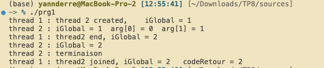

 # SY40 TP8
## prg1.c 

Voici la description complétée des différentes étapes d'exécution pthread.

 

 

## prg2.c

 Le programme 2 est modifié pour gérer à la fois l'incrémentation multithreadée et gère l'exclusion mutuelle via l'ajout d'un mutex.

 La fonction f d'incrémentation a été modifiée pour verrouiller le mutex avant l'incrémentation et le déverrouiller lorsqu'elle se termine :

 

 La fonction main() se charge d'initialiser le nombre de threads dynamiquement,\ d'initialiser le mutex utilisé, et de créer chaque thread via pthread exécutant la fonction f d'incrémentation. On passe également le numéro du thread en argument à la fonction f pour l'affichage dans le printf().

 Chaque thread se termine via pthread_join, on affiche le iGlobal final et on detruit le mutex et le tableau thread alloué.

 

 *La fonction main chargée d'initialiser les mutex, threads, et affiche le résultat final.*

## prg3.c
 Le programme initialise une variable *INT_QQUE*, correspondant à la valeur maximale que l'int peut prendre sur le système (définit par les macros de l'implémentation POSIX).

 *INT_QQUE* vaut donc (2147483647/10000) soit 214748 lorsque arrondi. Le but du programme est de synchroniser 2 threads pour incrémenter la variable i, et arrêter le programme losque i est égal à *INT_QQUE*. Pour éviter une race condition entre l'incrémentation et la vérification de la variable, il est nécessaire d'utiliser les mutex + cond_wait pour synchroniser les threads.

 Pour cela, le programme possède 2 threads, le main thread et le second thread. Le premier se chargera d'initialiser le thread2 via pthread_init qui executera codeThread2(), puis exécute codeThread1.
 Le main thread initialise également les pthread_cond et mutex, qui sont nécessaire pour contrôler la synchronisation de la variable i.

 ***codeThread1*** appelle ***pack1_attendre***, qui verouille le mutex, vérifie si *i* vaut *INT_QQUE*, attend tant que ça n'est pas le cas et débloque le mutex.

 ***codeThread2***, lui, va appeler ***pack1_signalerUn***, qui verouille le mutex, incrémente *i* et vérifie si *i* vaut *INT_QQUE*, débloque le mutex, et recommence tant que la condition n'est pas remplie. Le signal de fin de l'itération s'effectue par ***pthread_cond_signal***, qui va envoyer le signal à l'attente de ***pack1_attendre***.

 Une fois que ***pack1_attendre*** est dévérouillé, ***codeThread1*** peut finir de s'exécuter et imprime la valeur de *i* et *INT_QQUE*.

 

## dining philosophers problem

 

 Pour chaque philosopher, j'initialise mon mutex et condition, et je crée un thread. En fin d'éxecution, je retourne au main thread via pthread_join, et je détruis les mutex. Chaque pthread créé exécute cette fonction (ici tourne à l'infini et retire l'intérêt de nettoyer nos fuites de mémoire en fin d'exec, mais bonne pratique de le faire quand même)

 La logique de répartiiton des couverts gauches et droit va se faire entre ***take_fork() et put_fork().***

 

 Ici, chaque philosophe va verrouiller son mutex et le mutex du philosophe immédiat à droite (gauche si nombre paire de philosophes), philosophe 2 va verrouiller philosophe 3, philosophe 4 va verrouiller philosophe 0 (à l'aide du modulo).
 Si les couverts ne sont pas disponibles, le thread attend. Cette fonctionnalité est ajoutée pour éviter une attente active présente si on utilise uniquement lock et unlock pour contrôler l'exécution.

  
 
 ***put_forks()*** fonctionne de manière analogue, il déverouille les mutex, et signale aux
 threads en attente de continuer.

 *Voici l'output obtenu, on observe que philosopher 2 ne mange pas avec 1 ou 3. (0 et 2, puis 1 et 4 mangent)*
